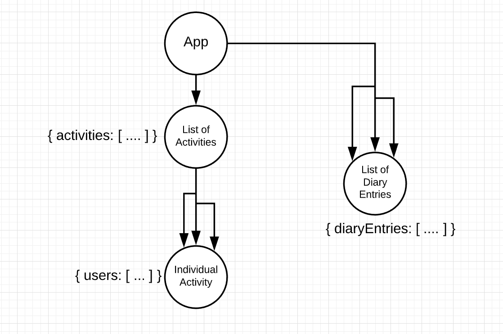
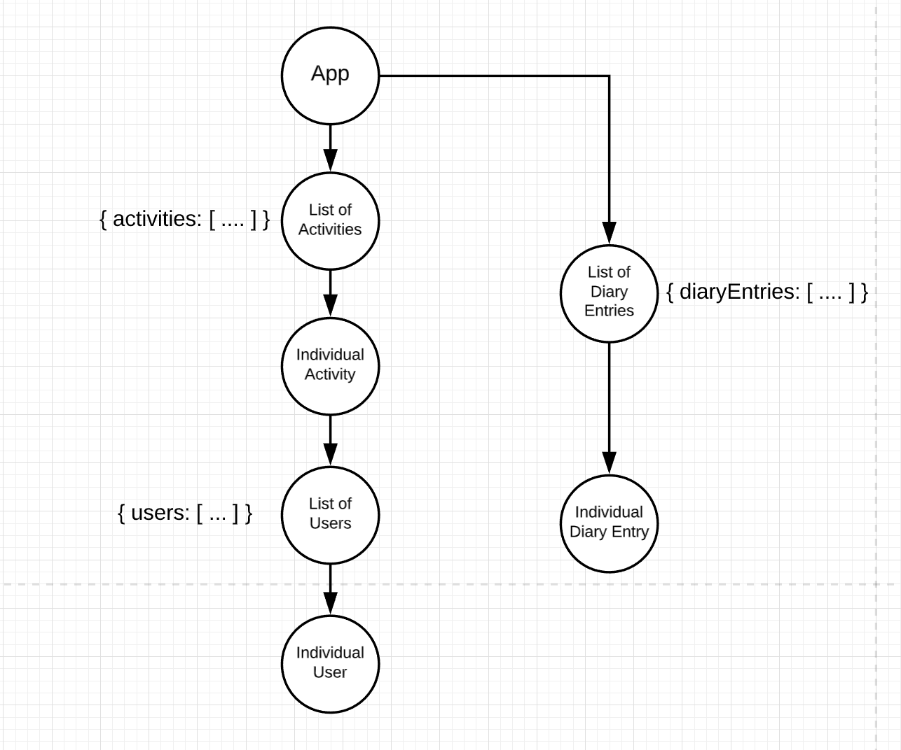
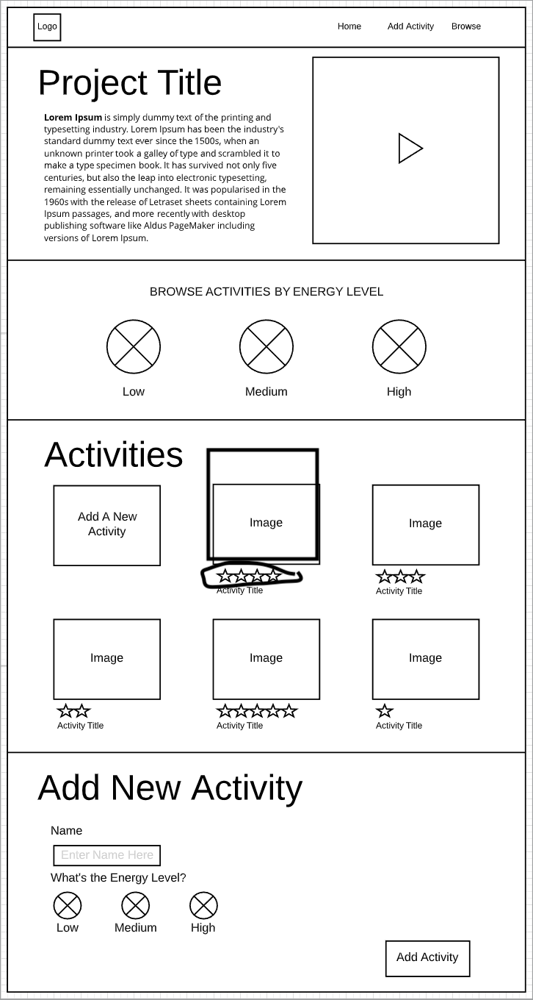
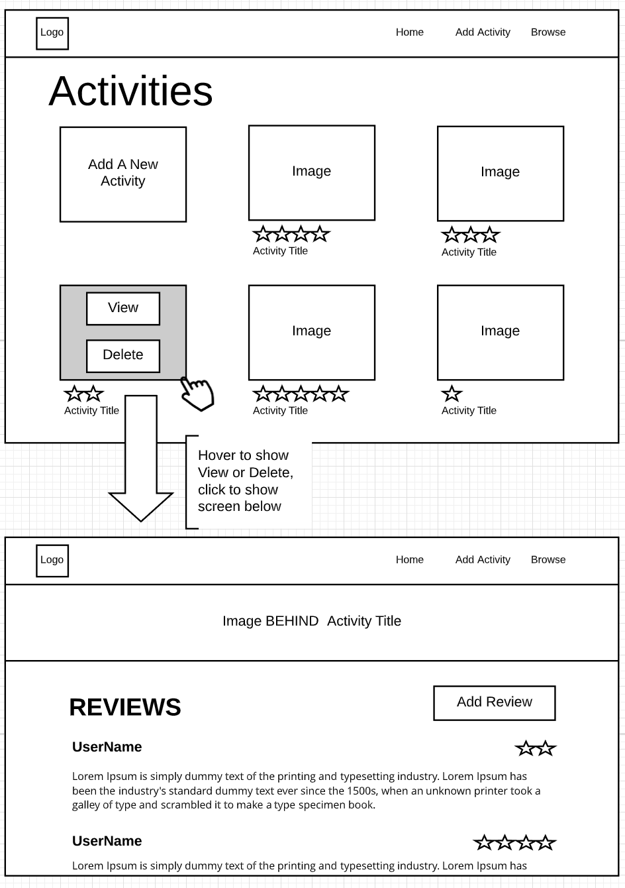
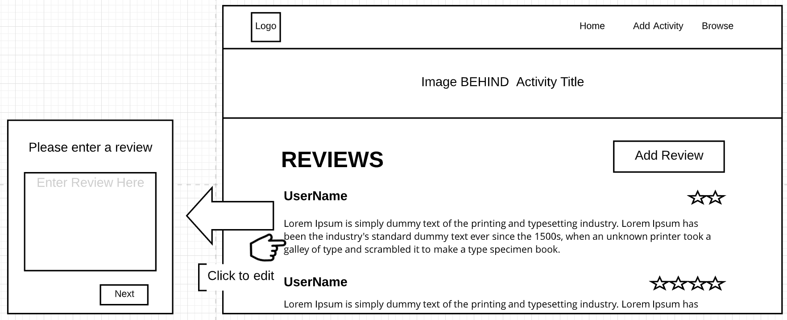
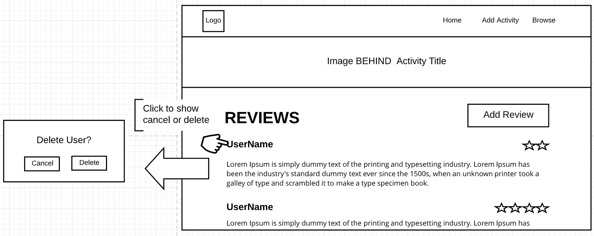

# SEI23-Project3
## Lone Wolf

Lone Wolf is a personal app for introverts to list places they love to hang out. Users can add any event of their choice and can choose an energy level of low medium or high. A review can be left for activities as well. Introvets can also use this as a diary if they so choose and leave posts.

* [Deployed App](https://git.heroku.com/calm-reef-29263.git)
* [Project Board](https://github.com/shawn-e-harris/project-3/projects/1)

## Technologies Used:
* React
* Express
* MongDB
* Node.js
* HTML
* CSS

## V2 Goals:
* enable each user to add a review and rating for each specific activity
* display an overall rating for events
* enable full CRUD on major components

## ERD

## Component Tree

## Wireframes

